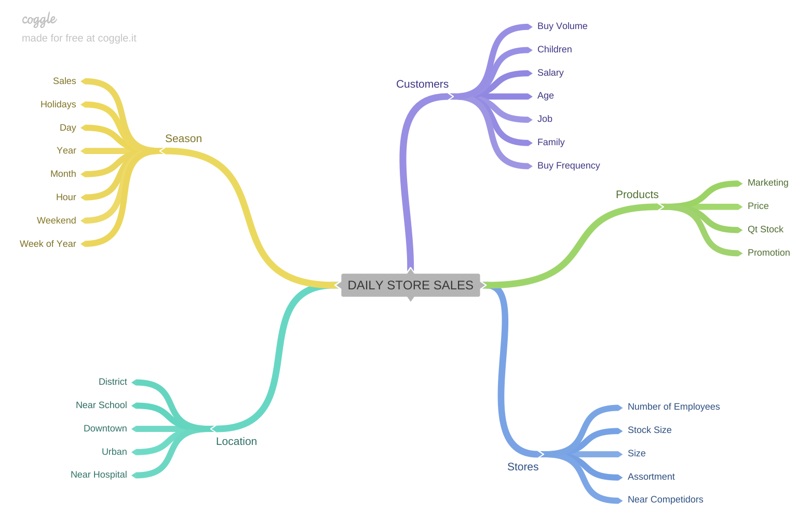

# Still in progress...

# Rossmann Project
This is the Rossmann Project for the Meigarom Lopes course. This project provide a real-world business problem and was made by me while following each step of the CRISP-DS (Cross-Industry Process - Data Science) methodology.

# Context

Rossmann operates over 3,000 drug stores in 7 European countries. Currently, Rossmann <b>store managers are tasked with predicting their daily sales for up to six weeks in advance </b>. Store sales are influenced by many factors, including promotions, competition, school and state holidays, seasonality, and locality. With thousands of individual managers predicting sales based on their unique circumstances, the accuracy of results can be quite varied.

# Mind Map

# Hyphotesis List

* Store with larger assortments should sell more.
* Store with closer competitors should sell less.
* Stores with longer competitors can sell more.
* Stores with active promotions for longer should sell more.
* Stores with more promotion days can sell more.
* Stores with more consecutive promotions should sell more.
* Stores that open on Christmas should sell more.
* Stores should sell more over the years.
* Stores should sell more in the second half of the year.
* Stores should sell more after the 10th of each month.
* Stores should sell less on weekends.
* Stores should sell less during school holidays.

# Dataset

Most of the fields are self-explanatory. The following are descriptions for those that aren't.

* Id - an Id that represents a (Store, Date) duple within the test set
* Store - a unique Id for each store
* Sales - the turnover for any given day (this is what you are predicting)
* Customers - the number of customers on a given day
* Open - an indicator for whether the store was open: 0 = closed, 1 = open
* StateHoliday - indicates a state holiday. Normally all stores, with few exceptions, are closed on state holidays. Note that all schools are closed on public holidays and weekends. a = public holiday, b = Easter holiday, c = Christmas, 0 = None
* SchoolHoliday - indicates if the (Store, Date) was affected by the closure of public schools
* StoreType - differentiates between 4 different store models: a, b, c, d
* Assortment - describes an assortment level: a = basic, b = extra, c = extended
* CompetitionDistance - distance in meters to the nearest competitor store
* CompetitionOpenSince[Month/Year] - gives the approximate year and month of the time the nearest competitor was opened
* Promo - indicates whether a store is running a promo on that day
* Promo2 - Promo2 is a continuing and consecutive promotion for some stores: 0 = store is not participating, 1 = store is participating
* Promo2Since[Year/Week] - describes the year and calendar week when the store started participating in Promo2
* PromoInterval - describes the consecutive intervals Promo2 is started, naming the months the promotion is started anew. E.g. "Feb,May,Aug,Nov" means each round starts in February, May, August, November of any given year for that store

# Files
* **api/** - api.
* **data/** - The datas download from Kaggle.
* **img/** - Image of the mind map hyphotesis in this problem.
* **model/** - Directory to save the model.pkl.
* **notebooks/**: Notebooks made in this project.
* **parameter/** - Pickle files of all preprocessing made for reusing in the production step.
* **rossmann-telegram-api** - Rossmann telegram api.
* **webapp/** - Web api.
* **store_sales_prediction.ipynb** - Jupyter notebook file of all the of all development.
* **README.md** - This file

